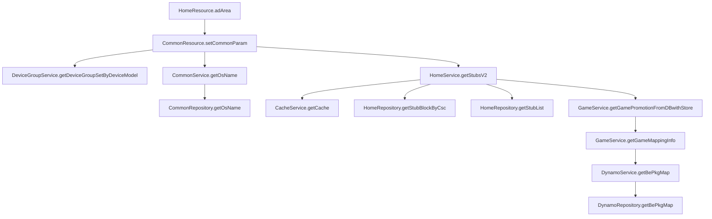

https://jira-mx.sec.samsung.net/browse/GLBESERVER-2508
기존 frontend-api-server에서 :HomeResource에서 :HomeService의 메서드 getStubsV2, getAdAreaV2를 호출하고 있음. 각 메서드는 :HomeRepository의 getStubList, getADAreaList를 호출함. (+ getStubsV2에서는 :HomeRepository의 getStubBlockByCsc를 호출하여 결과를 제공하지않는 필터 로직도 있음)
![[Pasted image 20260227150013.png]]

![[Pasted image 20260227150106.png]]

![[Pasted image 20260227150135.png]]

![[Pasted image 20260227153516.png]]

```
!lib:java.util..*&&!lib:java.lang..*&&!lib:java.text..*&&!lib:org.springframework..*&&!lib:org.mybatis..*&&!file:*//util//*&&!file:*//utils//*&&!file:*//model//*&&!lib:org.slf4j..*&&!lib:com.amazonaws..*
```

